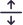

## Icons List

Note : Remaining icons should be added here in list

| Image                                   | Name                                                   | Image                                    | Name                                                    |
| --------------------------------------- | ------------------------------------------------------ | ---------------------------------------- | ------------------------------------------------------- |
|               | <mark style="color:purple;">`Activity`</mark>             |              | <mark style="color:purple;">`Adjust`</mark>            | 
|               | <mark style="color:purple;">`AdobeXD`</mark>             |              | <mark style="color:purple;">`Aeroplane`</mark>            |
|               | <mark style="color:purple;">`AlarmFill`</mark>             |              | <mark style="color:purple;">`Alarm`</mark>            |
|               | <mark style="color:purple;">`AlignCenter`</mark>             |              | <mark style="color:purple;">`AlignHorizontalLeft`</mark>            |
|               | <mark style="color:purple;">`AlignHorizontalRight`</mark>             |              | <mark style="color:purple;">`AlignJustify`</mark>            |
|               | <mark style="color:purple;">`AlignLeft`</mark>             |              | <mark style="color:purple;">`AlignRight`</mark>            |
|               | <mark style="color:purple;">`AlignVerticalBottom`</mark>             |              | <mark style="color:purple;">`AlignVerticalCenter`</mark>            |
|               | <mark style="color:purple;">`AlignVerticalTop`</mark>             |              | <mark style="color:purple;">`AlternateEmail`</mark>            |
|               | <mark style="color:purple;">`AppIndicator`</mark>             |              | <mark style="color:purple;">`AppStore`</mark>            |
|               | <mark style="color:purple;">`Apple`</mark>             |              | <mark style="color:purple;">`Archive`</mark>            |
|               | <mark style="color:purple;">`ArrowAngleContract`</mark>             |              | <mark style="color:purple;">`ArrowAngleExpand`</mark>            |
|               | <mark style="color:purple;">`ArrowAnticlockwise`</mark>             |              | <mark style="color:purple;">`ArrowClockwise`</mark>            |
|               | <mark style="color:purple;">`ArrowCollapse`</mark>             |              | <mark style="color:purple;">`ArrowDownUp`</mark>            |
|               | <mark style="color:purple;">`ArrowDown`</mark>             |              | <mark style="color:purple;">`ArrowExpand`</mark>            |
|               | <mark style="color:purple;">`ArrowFullScreen`</mark>             |              | <mark style="color:purple;">`ArrowLeftRight`</mark>            |
|               | <mark style="color:purple;">`ArrowLeft`</mark>             |              | <mark style="color:purple;">`ArrowRepeat`</mark>            |
|               | <mark style="color:purple;">`ArrowRight`</mark>             |              | <mark style="color:purple;">`ArrowToDownCircle`</mark>            |
|               | <mark style="color:purple;">`ArrowToDown`</mark>             |              | <mark style="color:purple;">`ArrowToLeftCircle`</mark>            |
|               | <mark style="color:purple;">`ArrowToLeft`</mark>             |              | <mark style="color:purple;">`ArrowToRightCircle`</mark>            |
|               | <mark style="color:purple;">`ArrowToRight`</mark>             |              | <mark style="color:purple;">`ArrowToUpCircle`</mark>            |
|               | <mark style="color:purple;">`ArrowToUp`</mark>             |              | <mark style="color:purple;">`ArrowUp`</mark>            |
|               | <mark style="color:purple;">`ArrowsMove`</mark>             |              | <mark style="color:purple;">`AspectRatio`</mark>            |
|               | <mark style="color:purple;">`Attachment`</mark>             |              | <mark style="color:purple;">`AwardFill`</mark>            |
|               | <mark style="color:purple;">`Award`</mark>             |              | <mark style="color:purple;">`BackSpaceFill`</mark>            |
|               | <mark style="color:purple;">`BackspaceReverseFill`</mark>             |              | <mark style="color:purple;">`BackspaceReverse`</mark>            |
|               | <mark style="color:purple;">`Backspace`</mark>             |              | <mark style="color:purple;">`BackwardCircle`</mark>            |
|               | <mark style="color:purple;">`Badge4kFill`</mark>             |              | <mark style="color:purple;">`Badge4k`</mark>            |
|               | <mark style="color:purple;">`Badge8kFill`</mark>             |              | <mark style="color:purple;">`Badge8k`</mark>            |
|               | <mark style="color:purple;">`ArrowUp`</mark>             |              | <mark style="color:purple;">`ArrowLeft`</mark>            |
|          | <mark style="color:purple;">`ArrowUpFill`</mark>         |         | <mark style="color:purple;">`ArrowLeftFill`</mark>        |
|        | <mark style="color:purple;">`ArrowUpCircle`</mark>       |       | <mark style="color:purple;">`ArrowLeftCircle`</mark>      |
|             | <mark style="color:purple;">`ArrowDown`</mark>           |             | <mark style="color:purple;">`ArrowRight`</mark>           |
|        | <mark style="color:purple;">`ArrowDownFill`</mark>       |        | <mark style="color:purple;">`ArrowRightFill`</mark>       |
|      | <mark style="color:purple;">`ArrowDownCircle`</mark>     |             | <mark style="color:purple;">`ArrowRightCircle`</mark>     |
|   | <mark style="color:purple;">`ArrowToDownCircle`</mark>   |      | <mark style="color:purple;">`ArrowToDownFill`</mark>      |
|     | <mark style="color:purple;">`ArrowToUpCircle`</mark>     |        | <mark style="color:purple;">`ArrowToUpFill`</mark>        |
|   | <mark style="color:purple;">`ArrowToLeftCircle`</mark>   |      | <mark style="color:purple;">`ArrowToLeftFill`</mark>      |
|  | <mark style="color:purple;">`ArrowToRightCircle`</mark>  |     | <mark style="color:purple;">`ArrowToRightFill`</mark>     |
|        | <mark style="color:purple;">`BackwardCircle`</mark>      |           | <mark style="color:purple;">`BackwardFill`</mark>         |
|        | <mark style="color:purple;">`BadgeCcFill`</mark>      |           | <mark style="color:purple;">`BadgeCc`</mark>         |
|         | <mark style="color:purple;">`BadgeHdFill`</mark>       |            | <mark style="color:purple;">`BadgeHd`</mark>          |
|        | <mark style="color:purple;">`BadgeTmFill`</mark>      |           | <mark style="color:purple;">`BadgeTm`</mark>         |
|        | <mark style="color:purple;">`BagCheckFill`</mark>      |           | <mark style="color:purple;">`BagCheck`</mark>         |
|        | <mark style="color:purple;">`BagDashFill`</mark>      |           | <mark style="color:purple;">`BagDash`</mark>         |
|        | <mark style="color:purple;">`BagFill`</mark>      |           | <mark style="color:purple;">`BagHeartFill`</mark>         |
|        | <mark style="color:purple;">`BagHeart`</mark>      |           | <mark style="color:purple;">`BagPlusFill`</mark>         |
|        | <mark style="color:purple;">`BagPlus`</mark>      |           | <mark style="color:purple;">`BagXFill`</mark>         |
|        | <mark style="color:purple;">`BagX`</mark>      |           | <mark style="color:purple;">`Bag`</mark>         |
|        | <mark style="color:purple;">`Balloon1Fill`</mark>      |           | <mark style="color:purple;">`Balloon1`</mark>         |
|        | <mark style="color:purple;">`BalloonFill`</mark>      |           | <mark style="color:purple;">`BalloonHeart1Fill`</mark>         |
|        | <mark style="color:purple;">`BalloonHeart1`</mark>      |           | <mark style="color:purple;">`BalloonHeartFill`</mark>         |
|        | <mark style="color:purple;">`BalloonHeart`</mark>      |           | <mark style="color:purple;">`Balloon`</mark>         |
|        | <mark style="color:purple;">`BandaidFill`</mark>      |           | <mark style="color:purple;">`Bandaid`</mark>         |
|        | <mark style="color:purple;">`Bank`</mark>      |           | <mark style="color:purple;">`Basket1Fill`</mark>         |
|        | <mark style="color:purple;">`Basket1`</mark>      |           | <mark style="color:purple;">`BasketFill`</mark>         |
|        | <mark style="color:purple;">`Basket`</mark>      |           | <mark style="color:purple;">`BasketBall`</mark>         |
|        | <mark style="color:purple;">`BathTub`</mark>      |           | <mark style="color:purple;">`BatteryCharging`</mark>         |
|        | <mark style="color:purple;">`BatteryFull`</mark>      |           | <mark style="color:purple;">`BatteryHalf`</mark>         |
|        | <mark style="color:purple;">`Battery`</mark>      |           | <mark style="color:purple;">`BeachAccess`</mark>         |
|        | <mark style="color:purple;">`Behance`</mark>      |           | <mark style="color:purple;">`Bell`</mark>         |
|        | <mark style="color:purple;">`Bicycle`</mark>      |           | <mark style="color:purple;">`BinFill`</mark>         |
|        | <mark style="color:purple;">`Bin`</mark>      |           | <mark style="color:purple;">`BinocularsFill`</mark>         |
|        | <mark style="color:purple;">`Binoculars`</mark>      |           | <mark style="color:purple;">`BlackLivesMatter`</mark>         |
|        | <mark style="color:purple;">`BlockquoteLeft`</mark>      |           | <mark style="color:purple;">`BlockquoteRight`</mark>         |
|        | <mark style="color:purple;">`Bluetooth1Fill`</mark>      |           | <mark style="color:purple;">`BlueTooth1`</mark>         |
|        | <mark style="color:purple;">`BluetoothFill`</mark>      |           | <mark style="color:purple;">`BlueTooth`</mark>         |
|        | <mark style="color:purple;">`Bold`</mark>      |           | <mark style="color:purple;">`BookmarkFill`</mark>         |
|        | <mark style="color:purple;">`Bookmark`</mark>      |           | <mark style="color:purple;">`BoundingBoxCircles`</mark>         |
|        | <mark style="color:purple;">`BoundingBox`</mark>      |           | <mark style="color:purple;">`BoxFill`</mark>         |
|        | <mark style="color:purple;">`Box`</mark>      |           | <mark style="color:purple;">`BracesAsterisk`</mark>         |
|        | <mark style="color:purple;">`Braces`</mark>      |           | <mark style="color:purple;">`Brightness`</mark>         |
|        | <mark style="color:purple;">`Broadcast`</mark>      |           | <mark style="color:purple;">`Browser`</mark>         |
|        | <mark style="color:purple;">`Brush`</mark>      |           | <mark style="color:purple;">`BucketFill`</mark>         |
|        | <mark style="color:purple;">`Bucket`</mark>      |           | <mark style="color:purple;">`Bulb`</mark>         |
|        | <mark style="color:purple;">`CalculatorFill`</mark>      |           | <mark style="color:purple;">`Calculator`</mark>         |
|        | <mark style="color:purple;">`CalendarCalendar`</mark>      |           | <mark style="color:purple;">`CalendarCheck`</mark>         |
|        | <mark style="color:purple;">`CalendarEdit`</mark>      |           | <mark style="color:purple;">`CalendarEvent`</mark>         |
|        | <mark style="color:purple;">`CalendarMinus`</mark>      |           | <mark style="color:purple;">`CalendarPlus`</mark>         |
|        | <mark style="color:purple;">`CalendarWeek`</mark>      |           | <mark style="color:purple;">`CalendarX`</mark>         |
|        | <mark style="color:purple;">`Calendar`</mark>      |           | <mark style="color:purple;">`CallAdd`</mark>         |
|        | <mark style="color:purple;">`CallEnd`</mark>      |           | <mark style="color:purple;">`CameraFill`</mark>         |
|        | <mark style="color:purple;">`CameraReelFill`</mark>      |           | <mark style="color:purple;">`CameraReel`</mark>         |
|        | <mark style="color:purple;">`CameraVideoFill`</mark>      |           | <mark style="color:purple;">`CameraVideoOffFill`</mark>         |
|        | <mark style="color:purple;">`CameraVideoOff`</mark>      |           | <mark style="color:purple;">`CapsLock1`</mark>         |
|        | <mark style="color:purple;">`CapsLock`</mark>      |           | <mark style="color:purple;">`CastConnected`</mark>         |
|        | <mark style="color:purple;">`Cast`</mark>      |           | <mark style="color:purple;">`CategoryFill`</mark>         |
|        | <mark style="color:purple;">`Category`</mark>      |           | <mark style="color:purple;">`Chat`</mark>         |
|        | <mark style="color:purple;">`CheckBoxOutlineBlank`</mark>      |           | <mark style="color:purple;">`CheckBox`</mark>         |
|        | <mark style="color:purple;">`ChildFriendly`</mark>      |           | <mark style="color:purple;">`ClipBoardFill`</mark>         |
|        | <mark style="color:purple;">`ClipBoard`</mark>      |           | <mark style="color:purple;">`Clock1`</mark>         |
|        | <mark style="color:purple;">`Clock`</mark>      |           | <mark style="color:purple;">`CloudDrizzleFill`</mark>         |
|        | <mark style="color:purple;">`CloudDrizzle`</mark>      |           | <mark style="color:purple;">`CloudUploadfill`</mark>         |
|        | <mark style="color:purple;">`CloudUpload`</mark>      |           | <mark style="color:purple;">`CodeAlt`</mark>         |
|        | <mark style="color:purple;">`Coffee`</mark>      |           | <mark style="color:purple;">`ColorPalette`</mark>         |
|        | <mark style="color:purple;">`Colorize`</mark>      |           | <mark style="color:purple;">`Compass1`</mark>         |
|        | <mark style="color:purple;">`Compass2`</mark>      |           | <mark style="color:purple;">`ContactBookFill`</mark>         |
|        | <mark style="color:purple;">`ContactBook`</mark>      |           | <mark style="color:purple;">`ContactLine`</mark>         |
|        | <mark style="color:purple;">`Coolicons`</mark>      |           | <mark style="color:purple;">`Css3`</mark>         |
|        | <mark style="color:purple;">`CupFill`</mark>      |           | <mark style="color:purple;">`Cup`</mark>         |
|        | <mark style="color:purple;">`Cupcake`</mark>      |           | <mark style="color:purple;">`CurrencyDollar`</mark>         |
|        | <mark style="color:purple;">`CurrencyEuro`</mark>      |           | <mark style="color:purple;">`CurrencyRupee`</mark>         |
|        | <mark style="color:purple;">`CurrencyYen`</mark>      |           | <mark style="color:purple;">`CursorText`</mark>         |
|        | <mark style="color:purple;">`DashboardFill`</mark>      |           | <mark style="color:purple;">`Dashboard`</mark>         |
|        | <mark style="color:purple;">`Degree360`</mark>      |           | <mark style="color:purple;">`DesktopAccessDisabled`</mark>         |
|        | <mark style="color:purple;">`DeviceHub`</mark>      |           | <mark style="color:purple;">`Devices`</mark>         |
|        | <mark style="color:purple;">`DirectionCar`</mark>      |           | <mark style="color:purple;">`DirectionRun`</mark>         |
|        | <mark style="color:purple;">`DirectionSubway`</mark>      |           | <mark style="color:purple;">`DirectionWalk`</mark>         |
|        | <mark style="color:purple;">`DirectionBike`</mark>      |           | <mark style="color:purple;">`DirectionsNoTransfer`</mark>         |
|        | <mark style="color:purple;">`Discord`</mark>      |           | <mark style="color:purple;">`Divide`</mark>         |
|        | <mark style="color:purple;">`DocumentDuplicate`</mark>      |           | <mark style="color:purple;">`DollarCoin`</mark>         |
|        | <mark style="color:purple;">`DotsHorizontalRounded`</mark>      |           | <mark style="color:purple;">`DotsHorizontal`</mark>         |
|        | <mark style="color:purple;">`DotsVerticalRounded`</mark>      |           | <mark style="color:purple;">`DotsVertical`</mark>         |
|        | <mark style="color:purple;">`Dribbble`</mark>      |           | <mark style="color:purple;">`Drive`</mark>         |
|        | <mark style="color:purple;">`DropFill`</mark>      |           | <mark style="color:purple;">`Drop`</mark>         |
|        | <mark style="color:purple;">`Dropbox`</mark>      |           | <mark style="color:purple;">`Dry`</mark>         |
|        | <mark style="color:purple;">`Duo`</mark>      |           | <mark style="color:purple;">`Edit1`</mark>         |
|        | <mark style="color:purple;">`Edit`</mark>      |           | <mark style="color:purple;">`EjectFill`</mark>         |
|        | <mark style="color:purple;">`Eject`</mark>      |           | <mark style="color:purple;">`Elevator`</mark>         |
|        | <mark style="color:purple;">`EncircledDivide`</mark>      |           | <mark style="color:purple;">`EncircledMinus`</mark>         |
|        | <mark style="color:purple;">`EncircledMultiply`</mark>      |           | <mark style="color:purple;">`EncircledPlus`</mark>         |
|        | <mark style="color:purple;">`EscalatorWarning`</mark>      |           | <mark style="color:purple;">`Escalator`</mark>         |
|        | <mark style="color:purple;">`EuroCoin`</mark>      |           | <mark style="color:purple;">`ExternalLink`</mark>         |
|        | <mark style="color:purple;">`Facebook`</mark>      |           | <mark style="color:purple;">`FamilyRestroom`</mark>         |
|        | <mark style="color:purple;">`Fence`</mark>      |           | <mark style="color:purple;">`Figma`</mark>         |
|        | <mark style="color:purple;">`FilePdf`</mark>      |           | <mark style="color:purple;">`File`</mark>         |
|        | <mark style="color:purple;">`FiletypeCss`</mark>      |           | <mark style="color:purple;">`FiletypeCsv`</mark>         |
|        | <mark style="color:purple;">`FiletypeDoc`</mark>      |           | <mark style="color:purple;">`FiletypeDocx`</mark>         |
|        | <mark style="color:purple;">`FiletypeExe`</mark>      |           | <mark style="color:purple;">`FiletypeJsx`</mark>         |
|        | <mark style="color:purple;">`FiletypeMp4`</mark>      |           | <mark style="color:purple;">`FiletypePpt`</mark>         |
|        | <mark style="color:purple;">`FiletypePptx`</mark>      |           | <mark style="color:purple;">`FiletypePy`</mark>         |
|        | <mark style="color:purple;">`FilterCenterFocus`</mark>      |           | <mark style="color:purple;">`FilterFill`</mark>         |
|        | <mark style="color:purple;">`Filter`</mark>      |           | <mark style="color:purple;">`FiltypePdf`</mark>         |
|        | <mark style="color:purple;">`FileExtinguisher`</mark>      |           | <mark style="color:purple;">`FlagFill`</mark>         |
|        | <mark style="color:purple;">`Flag`</mark>      |           | <mark style="color:purple;">`FlightLand`</mark>         |
|        | <mark style="color:purple;">`FlightTakeOff`</mark>      |           | <mark style="color:purple;">`FootBall`</mark>         |
|        | <mark style="color:purple;">`ForwardCircle`</mark>      |           | <mark style="color:purple;">`FuelStation`</mark>         |
|        | <mark style="color:purple;">`GamePad`</mark>      |           | <mark style="color:purple;">`Gem`</mark>         |
|        | <mark style="color:purple;">`Gift`</mark>      |           | <mark style="color:purple;">`Git`</mark>         |
|        | <mark style="color:purple;">`Github`</mark>      |           | <mark style="color:purple;">`GlobalNetwork`</mark>         |
|        | <mark style="color:purple;">`Google`</mark>      |           | <mark style="color:purple;">`HappyFace`</mark>         |
|        | <mark style="color:purple;">`Headset1`</mark>      |           | <mark style="color:purple;">`HeadsetFill`</mark>         |
|        | <mark style="color:purple;">`Headset`</mark>      |           | <mark style="color:purple;">`Heart1`</mark>         |
|        | <mark style="color:purple;">`HeartEmpty1`</mark>      |           | <mark style="color:purple;">`HeartEmpty`</mark>         |
|        | <mark style="color:purple;">`HeartFill`</mark>      |           | <mark style="color:purple;">`Heart`</mark>         |
|        | <mark style="color:purple;">`Helmet`</mark>      |           | <mark style="color:purple;">`HomeFill`</mark>         |
|        | <mark style="color:purple;">`HomeWork`</mark>      |           | <mark style="color:purple;">`HourglassBottom`</mark>         |
|        | <mark style="color:purple;">`HourglassSplit`</mark>      |           | <mark style="color:purple;">`Html5`</mark>         |
|        | <mark style="color:purple;">`ImageFill`</mark>      |           | <mark style="color:purple;">`Image`</mark>         |
|        | <mark style="color:purple;">`Images`</mark>      |           | <mark style="color:purple;">`Infinity`</mark>         |
|        | <mark style="color:purple;">`InfoFill`</mark>      |           | <mark style="color:purple;">`Info`</mark>         |
|        | <mark style="color:purple;">`Instagram`</mark>      |           | <mark style="color:purple;">`InvertColorsOff`</mark>         |
|        | <mark style="color:purple;">`Invision`</mark>      |           | <mark style="color:purple;">`IosAddCircle`</mark>         |
|        | <mark style="color:purple;">`IosArrowDownCircle`</mark>      |           | <mark style="color:purple;">`IosArrowDownCircleFill`</mark>         |
|        | <mark style="color:purple;">`IosArrowLeftCircleFill`</mark>      |           | <mark style="color:purple;">`IosArrowLeftCircle`</mark>         |
|        | <mark style="color:purple;">`IosArrowRightCircleFill`</mark>      |           | <mark style="color:purple;">`IosArrowRightCircle`</mark>         |
|        | <mark style="color:purple;">`IosArrowUpCircleFill`</mark>      |           | <mark style="color:purple;">`IosArrowUpCircle`</mark>         |
|        | <mark style="color:purple;">`IosCloaseCircle`</mark>      |           | <mark style="color:purple;">`IosRemoveCircle`</mark>         |
|        | <mark style="color:purple;">`IsoFill`</mark>      |           | <mark style="color:purple;">`Iso`</mark>         |
|        | <mark style="color:purple;">`Italic`</mark>      |           | <mark style="color:purple;">`Javascript`</mark>         |
|        | <mark style="color:purple;">`Kanban1`</mark>      |           | <mark style="color:purple;">`KanbanFill`</mark>         |
|        | <mark style="color:purple;">`Kanban`</mark>      |           | <mark style="color:purple;">`Key`</mark>         |
|              | <mark style="color:purple;">`purpletooth`</mark>           |          | <mark style="color:purple;">`purpletoothFill`</mark>        |
|               | <mark style="color:purple;">`CodeAlt`</mark>             |               | <mark style="color:purple;">`CodeFill`</mark>             |
|           | <mark style="color:purple;">`PauseCircle`</mark>         |              | <mark style="color:purple;">`PauseFill`</mark>            |
|            | <mark style="color:purple;">`PlayCircle`</mark>          |               | <mark style="color:purple;">`PlayFill`</mark>             |
|           | <mark style="color:purple;">`AlignCenter`</mark>         |   | <mark style="color:purple;">`AlignHorizontalLeft`</mark>  |
|          | <mark style="color:purple;">`AlignJustify`</mark>        |  | <mark style="color:purple;">`AlignHorizontalRight`</mark> |
|             | <mark style="color:purple;">`AlignLeft`</mark>           |             | <mark style="color:purple;">`AlignRight`</mark>           |
|  | <mark style="color:purple;">`AlignVerticalBottom`</mark> |   | <mark style="color:purple;">`AlignVerticalCenter`</mark>  |
|     | <mark style="color:purple;">`AlignVerticalTop`</mark>    |               | <mark style="color:purple;">`Compass1`</mark>             |
|         | <mark style="color:purple;">`DashboardFill`</mark>       |               | <mark style="color:purple;">`Compass2`</mark>             |
|              | <mark style="color:purple;">`Dashboard`</mark>           |               | <mark style="color:purple;">`HomeFill`</mark>             |
|   | <mark style="color:purple;">`LocationMarkerFill`</mark>  |         | <mark style="color:purple;">`LocationMarker`</mark>       |
|                   | <mark style="color:purple;">`Task`</mark>                |               | <mark style="color:purple;">`TaskFill`</mark>             |
|                   | <mark style="color:purple;">`Bookmark`</mark>                |               | <mark style="color:purple;">`BookmarkFill`</mark>             |
|                   | <mark style="color:purple;">`Browser`</mark>                |               | <mark style="color:purple;">`CategoryFill`</mark>             |
|                   | <mark style="color:purple;">`Category`</mark>                |               | <mark style="color:purple;">`Headset1`</mark>             |
|                   | <mark style="color:purple;">`Headset`</mark>                |               | <mark style="color:purple;">`HeadsetFill`</mark>             |
|                   | <mark style="color:purple;">`Heart`</mark>                |               | <mark style="color:purple;">`Terminal`</mark>             |
|                   | <mark style="color:purple;">`Activity`</mark>                |               | <mark style="color:purple;">`Adjust`</mark>             |
|                   | <mark style="color:purple;">`Bell`</mark>                |               | <mark style="color:purple;">`Brightness`</mark>             |
|                   | <mark style="color:purple;">`Clock`</mark>                |               | <mark style="color:purple;">`Clock1`</mark>             |
|                   | <mark style="color:purple;">`ContactBookFill`</mark>                |               | <mark style="color:purple;">`ContactBook`</mark>             |
|                   | <mark style="color:purple;">`ContactLine`</mark>                |               | <mark style="color:purple;">`Divide`</mark>             |
|                   | <mark style="color:purple;">`DoNotDisturb`</mark>                |               | <mark style="color:purple;">`DotsHorizontal`</mark>             |
|                   | <mark style="color:purple;">`DotsHorizontalRounded`</mark>                |               | <mark style="color:purple;">`DotsVertical`</mark>             |
|                   | <mark style="color:purple;">`DotsVerticalRounded`</mark>                |               | <mark style="color:purple;">`Edit`</mark>             |
|                   | <mark style="color:purple;">`EncircleDivide`</mark>                |               | <mark style="color:purple;">`EncircleDivideFill`</mark>             |
|                   | <mark style="color:purple;">`EncircleMinus`</mark>                |               | <mark style="color:purple;">`EncircledMinusFill`</mark>             |
|                   | <mark style="color:purple;">`EncircledMultiplyFill`</mark>                |               | <mark style="color:purple;">`EncircleMultiply`</mark>             |
|                   | <mark style="color:purple;">`Filter`</mark>                |               | <mark style="color:purple;">`FilterFill`</mark>             |
|                   | <mark style="color:purple;">`Flag`</mark>                |               | <mark style="color:purple;">`FlagFill`</mark>             |
|                   | <mark style="color:purple;">`Image`</mark>                |               | <mark style="color:purple;">`ImageFill`</mark>             |
|                   | <mark style="color:purple;">`Info`</mark>                |               | <mark style="color:purple;">`InfoFill`</mark>             |
|                   | <mark style="color:purple;">`ListLi`</mark>                |               | <mark style="color:purple;">`ListUi`</mark>             |
|                   | <mark style="color:purple;">`LockFill`</mark>                |               | <mark style="color:purple;">`Message`</mark>             |
|                   | <mark style="color:purple;">`Minus`</mark>                |               | <mark style="color:purple;">`Multiply`</mark>             |
|                   | <mark style="color:purple;">`PieChart`</mark>                |               | <mark style="color:purple;">`Plus`</mark>             |
|                   | <mark style="color:purple;">`ReactIcon`</mark>                |               | <mark style="color:purple;">`ReactFill`</mark>             |
|                   | <mark style="color:purple;">`SandClock`</mark>                |               | <mark style="color:purple;">`SaveAlt`</mark>             |
|                   | <mark style="color:purple;">`Sent`</mark>                |               | <mark style="color:purple;">`Share`</mark>             |
|                   | <mark style="color:purple;">`Sms`</mark>                |               | <mark style="color:purple;">`TagAlt`</mark>             |
|                   | <mark style="color:purple;">`TagAlt2`</mark>                |               | <mark style="color:purple;">`UnlockFill`</mark>             |
|                   | <mark style="color:purple;">`UserFill`</mark>                |               | <mark style="color:purple;">`UserFill1`</mark>             |
|                   | <mark style="color:purple;">`UserProfile`</mark>                |               | <mark style="color:purple;">`UserProfileFill`</mark>             |
|                   | <mark style="color:purple;">`ViewList`</mark>                |               | <mark style="color:purple;">`Warning`</mark>             |
|                   | <mark style="color:purple;">`WarningFill`</mark>                |               | <mark style="color:purple;">`EncirclePlus`</mark>             |
|                   | <mark style="color:purple;">`EncircledPlusFill`</mark>                |               | <mark style="color:purple;">`Dribbble`</mark>             |
|                   | <mark style="color:purple;">`Clipboard`</mark>                |               | <mark style="color:purple;">`ClipboardFill`</mark>             |
|                   | <mark style="color:purple;">`CloudDrizzle`</mark>                |               | <mark style="color:purple;">`CloudDrizzleFill`</mark>             |
|                   | <mark style="color:purple;">`CloudUpload`</mark>                |               | <mark style="color:purple;">`CloudUploadFill`</mark>             |
|                   | <mark style="color:purple;">`DollarCoin`</mark>                |               | <mark style="color:purple;">`RupeeCoin`</mark>             |
|                   | <mark style="color:purple;">`Printer`</mark>                |               | <mark style="color:purple;">`PrinterFill`</mark>             |
|                   | <mark style="color:purple;">`Trophy`</mark>                |               | <mark style="color:purple;">`TrophyFill`</mark>             |
|                   | <mark style="color:purple;">`Recycle`</mark>                |               | <mark style="color:purple;">`Search`</mark>             |
|                   | <mark style="color:purple;">`ZoomIn`</mark>                |               | <mark style="color:purple;">`ZoomOut`</mark>             |
|                   | <mark style="color:purple;">`SOS-Help`</mark>                |               | <mark style="color:purple;">`SOS-Help-Fill`</mark>             |
|                   | <mark style="color:purple;">`Ubuntu`</mark>                |               | <mark style="color:purple;">`UbuntuFill`</mark>             |