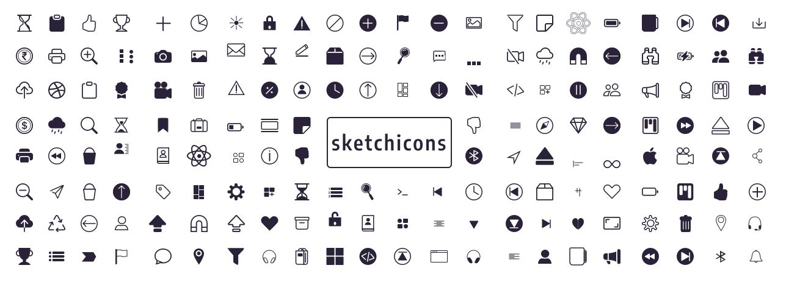

#  Sketch-icons

Sketch icons is a completely open-source icon set with 600+ icons that makes it easy for individuals to utilise icons. The Sketch-icons Web Component is a simple and effective way to incorporate Sketch icons into your app. The component will dynamically load an SVG for each icon, ensuring that your app only requests the icons it requires.

[](https://www.npmjs.com/package/sketch-icons)
[](https://www.npmjs.com/package/sketch-icons)
[](https://www.npmjs.com/package/sketch-icons)
[](https://www.npmjs.com/package/sketch-icons)
<a href="https://github.com/tabler/tabler-icons/blob/master/LICENSE"></a>



## Installation

```bash
npm i sketch-icons
# or
yarn add sketch-icons
```

## Usage

```jsx
import { PlayFill } from "sketch-icons";

class Icons extends React.Component {
  render() {
    return (
      <h2>
        Here's a <PlayFill />
      </h2>
    );
  }
}
```

```jsx
import { GitHubColor } from "sketch-icons";

class Icons extends React.Component {
  render() {
    return (
      <h2>
        I am a <GitHubColor /> contributor />
      </h2>
    );
  }
}
```

## Using CDN

If you want to use the icons in your project, you can use the CDN. Add the following cdn to your HTML file.

```html
<link
  rel="stylesheet"
  type="text/css"
  href="https://unpkg.com/sketch-icons@0.1.13/dist/cdn/icons.css"
/>
```

## Example

To utilize the pre-built icon from the sketch icons bundle, populate the `class` property on the `i` tag

```html
<head>
  ...
  <link
    rel="stylesheet"
    type="text/css"
    href="https://unpkg.com/sketch-icons@0.1.13/dist/cdn/icons.css"
  />
  ...
</head>
<body>
  ...
  <i class="sk sk-alarm-fill"></i>
  ...
</body>
```

## Using CSS Selector

You can change the properties of icon using the css selector. The selector is `.sk-` followed by the icon name.

```css
.sk-alarm-fill {
  color: red;
  font-size: 35px;
}
```

## Properties

| Property    | Attribute                    | Default   |
| ----------- | ---------------------------- | --------- |
| color       | `color="color"`              | `#2A2238` |
| height      | `height={height}`            | `32`      |
| width       | `width={width}`              | `32`      |
| stroke      | `stroke="stroke-color"`      | `#2A2238` |
| strokeWidth | `strokeWidth="stroke-width"` | `1.5`     |

```jsx
import { ArrowUpCircle, ArrowDown } from "sketch-icons";

class Icons extends React.Component {
  render() {
    return (
      <h2>
        Go Up <ArrowUpCircle height={100} width={100} />
        Move Down <ArrowDown stroke="blue" strokeWidth="0.1" color="#ffffff" />
      </h2>
    );
  }
}
```

## How to Contribute Assets

**Note :** At this moment, we just ask that you place your icon in the assets folder and not to run build commands.

1. Create an icon with color `#2A2238` and strokeWidth of `1` or `1.5`.
1. Export your icon to `svg` format.
1. Place your assets in the `assets/simple` folder.
1. Similarly if the icon is colored place it in `assets/color` folder.
1. Add your asset in [icon_list](icon_list.md).
1. Submit a Pull Request with title `[Icon request]`
1. Your asset will be added to the list.

## Icon Description

| Icon Type | File name            | Size    | Color   |
| --------- | -------------------- | ------- | ------- |
| Normal    | icon-name.svg        | 28 x 28 | #2a2238 |
| Circle    | icon-name-circle.svg | 28 x 28 | #2a2238 |
| Filled    | icon-name-fill.svg   | 28 x 28 | #2a2238 |
| Color     | icon-name-color.svg  | 28 x 28 | colors  |

**Note :** Ensure that the names of the icons do not conflict with those that already exist.

## Icons List

Click here to see all [sketch-icons](./icon_list.md)

## Changelog

Check here for [CHANGELOG](CHANGELOG.md)

## Contributing

Please see [CONTRIBUTING GUIDELINES](CONTRIBUTING.md)

## Code of Conduct

Please read the [CODE OF CONDUCT](CODE_OF_CONDUCT.md)

## Versioning

Refer [Versioning](VERSIONING.md)

## Our Top Contributors 
<p align="center"><a href="https://github.com/garudatechnologydevelopers/Sketch-icons/graphs/contributors">
  
</a></p>


Color icons credits : Jenish Lunagariya under [CC BY 4.0](https://creativecommons.org/licenses/by/4.0/)
