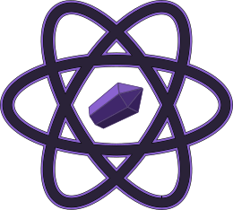

#  Sketch-icons


Sketch-icons is an icon library that makes using icons simple for everyone.

https://sketch-icons.gitbook.io/docs/


[](https://www.npmjs.com/package/sketch-icons)
[](https://www.npmjs.com/package/sketch-icons)
[](https://www.npmjs.com/package/sketch-icons)
<a href="https://github.com/tabler/tabler-icons/blob/master/LICENSE"></a>


## Installation

```bash
npm i sketch-icons
# or
yarn add sketch-icons
```

## Usage

```jsx
import { PlayFill } from "sketch-icons";

class Icons extends React.Component {
  render() {
    return (
      <h2>
        Here's a <PlayFill />
      </h2>
    );
  }
}
```

## Properties

| Property    | Attribute                    | Default   |
| ----------- | ---------------------------- | --------- |
| color       | `color="color"`              | `#2A2238` |
| height      | `height={height}`            | `32`      |
| width       | `width={width}`              | `32`      |
| stroke      | `stroke="stroke-color"`      | `#2A2238` |
| strokeWidth | `strokeWidth="stroke-width"` | `1.5`     |

```jsx
import { ArrowUpCircle, ArrowDown } from "sketch-icons";

class Icons extends React.Component {
  render() {
    return (
      <h2>
        Go Up <ArrowUpCircle height={100} width={100} />
        Move Down <ArrowDown stroke="blue" strokeWidth="0.1" color="#ffffff" />
      </h2>
    );
  }
}
```

## How to Contribute Assets

**Note :** At this moment, we just ask that you place your icon in the assets folder and not to run build commands.

1. Create an icon with color `#2A2238` and strokeWidth of `1` or `1.5`.
1. Export your icon to `svg` format.
1. Place your assets in the `assets` folder.
1. Add your asset in [icon_list](icon_list.md).
1. Run the `yarn build` command. (\*optional)
1. Type `yarn changeset` and choose major/minor/patch, then write a summary. (\*optional)
1. Submit a Pull Request with title `[Icon request]`
1. Your asset will be added to the list.

**Note :** Only icons with color will be permitted for 3D icons. Feel free to contribute.

## Icon Description

| Icon Type | File name            | Size    | Color   |
| --------- | -------------------- | ------- | ------- |
| Normal    | icon-name.svg        | 28 x 28 | #2a2238 |
| Circle    | icon-name-circle.svg | 28 x 28 | #2a2238 |
| Filled    | icon-name-fill.svg   | 28 x 28 | #2a2238 |
| 3d Icons  | icon-name-3d.svg     | 28 x 28 | colors  |

## Icons List

Click here to see all [sketch-icons](./icon_list.md)
## Contributing

Please see [CONTRIBUTING GUIDELINES](CONTRIBUTING.md)

## Code of Conduct

Please read the [CODE OF CONDUCT](CODE_OF_CONDUCT.md)

## Versioning

Refer [Versioning](VERSIONING.md)

## Contributors

| [](https://github.com/ndrohith09) | [](https://github.com/Aravind2203) | [](https://github.com/Revanth2002) | [](https://github.com/GarudaTechDev) | [](https://github.com/smlogsubramani) | [](https://github.com/Tr0612) | [](https://github.com/Rams01010010) |
| :--------------------------------------------------------------------------------------------------------------------------------: | :------------------------------------------------------------------------------------------------------------------------------------------: | :----------------------------------------------------------------------------------------------------------------------------------: | :---------------------------------------------------------------------------------------------------------------------------------------: | :-----------------------------------------------------------------------------------------------------------------------------------------: | :-------------------------------------------------------------------------------------------------------------------------: | :-------------------------------------------------------------------------------------------------------------------------------------: |
|                                             [ND Rohith](https://github.com/ndrohith09)                                             |                                            [Aravind Swaminathan](https://github.com/Aravind2203)                                             |                                             [ND Revanth](https://github.com/Revanth2002)                                             |                                             [GarudaTechDev](https://github.com/GarudaTechDev)                                             |                                            [SM Logsubramani](https://github.com/smlogsubramani)                                             |                                          [Thanushraam](https://github.com/Tr0612)                                           |                                            [RAM SOLAIAPPAN](https://github.com/Rams01010010) 


