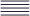
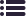
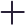
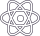

# Sketch-icons


Sketch-icons is an icon library that makes using icons simple for everyone.

<!-- **Note** : Sketch-icons is still a beta version.We recommend you to wait till we publish the package -->

https://sketch-icons.gitbook.io/docs/

[](https://www.npmjs.com/package/sketch-icons)
[](https://www.npmjs.com/package/sketch-icons)
[](https://www.npmjs.com/package/sketch-icons)
<a href="https://github.com/tabler/tabler-icons/blob/master/LICENSE"></a>

## Installation

```bash
npm i sketch-icons
# or
yarn add sketch-icons
```

## Usage

```jsx
import { PlayFill } from "sketch-icons";

class Icons extends React.Component {
  render() {
    return (
      <h2>
        Here's a <PlayFill />
      </h2>
    );
  }
}
```

## Properties

| Property    | Attribute                    | Default   |
| ----------- | ---------------------------- | --------- |
| color       | `color="color"`              | `#2A2238` |
| height      | `height={height}`            | `32`      |
| width       | `width={width}`              | `32`      |
| stroke      | `stroke="stroke-color"`      | `#2A2238` |
| strokeWidth | `strokeWidth="stroke-width"` | `1.5`     |

```jsx
import { ArrowUpCircle, ArrowDown } from "sketch-icons";

class Icons extends React.Component {
  render() {
    return (
      <h2>
        Go Up <ArrowUpCircle height={100} width={100} />
        Move Down <ArrowDown stroke="blue" strokeWidth="0.1" color="#ffffff" />
      </h2>
    );
  }
}
```

## How to Contribute Assets

**Note :** At this moment, we just ask that you place your icon in the assets folder and not to run build commands.

1. Create an icon with color `#2A2238` and strokeWidth of `1` or `1.5`.
1. Export your icon to `svg` format.
1. Place your assets in the `assets` folder.
2. Add your asset in [icon_list](icon_list.md).
3. Run the `yarn build` command. (*optional)
4. Type `yarn changeset` and choose major/minor/patch, then write a summary. (*optional)
5. Submit a Pull Request with title `[Icon request]`
6. Your asset will be added to the list.

**Note :** Only icons with color will be permitted for 3D icons. Feel free to contribute.

## Icon Description

| Icon Type | File name            | Size    | Color   |
| --------- | -------------------- | ------- | ------- |
| Normal    | icon-name.svg        | 28 x 28 | #2a2238 |
| Circle    | icon-name-circle.svg | 28 x 28 | #2a2238 |
| Filled    | icon-name-fill.svg   | 28 x 28 | #2a2238 |
| 3d Icons  | icon-name-3d.svg     | 28 x 28 | colors  |

## Contributing

Please see [CONTRIBUTING GUIDELINES](CONTRIBUTING.md)

## Code of Conduct

Please read the [CODE OF CONDUCT](CODE_OF_CONDUCT.md)

## Versioning

Refer [Versioning](VERSIONING.md)

## Icons List

| Image                                   | Name                                                   | Image                                    | Name                                                    |
| --------------------------------------- | ------------------------------------------------------ | ---------------------------------------- | ------------------------------------------------------- |
|               | <mark style="color:blue;">`ArrowUp`</mark>             |              | <mark style="color:blue;">`ArrowLeft`</mark>            |
|          | <mark style="color:blue;">`ArrowUpFill`</mark>         |         | <mark style="color:blue;">`ArrowLeftFill`</mark>        |
|        | <mark style="color:blue;">`ArrowUpCircle`</mark>       |       | <mark style="color:blue;">`ArrowLeftCircle`</mark>      |
|             | <mark style="color:blue;">`ArrowDown`</mark>           |             | <mark style="color:blue;">`ArrowRight`</mark>           |
|        | <mark style="color:blue;">`ArrowDownFill`</mark>       |        | <mark style="color:blue;">`ArrowRightFill`</mark>       |
|      | <mark style="color:blue;">`ArrowDownCircle`</mark>     |             | <mark style="color:blue;">`ArrowRightCircle`</mark>     |
|   | <mark style="color:blue;">`ArrowToDownCircle`</mark>   |      | <mark style="color:blue;">`ArrowToDownFill`</mark>      |
|     | <mark style="color:blue;">`ArrowToUpCircle`</mark>     |        | <mark style="color:blue;">`ArrowToUpFill`</mark>        |
|   | <mark style="color:blue;">`ArrowToLeftCircle`</mark>   |      | <mark style="color:blue;">`ArrowToLeftFill`</mark>      |
|  | <mark style="color:blue;">`ArrowToRightCircle`</mark>  |     | <mark style="color:blue;">`ArrowToRightFill`</mark>     |
|        | <mark style="color:blue;">`BackwardCircle`</mark>      |           | <mark style="color:blue;">`BackwardFill`</mark>         |
|         | <mark style="color:blue;">`ForwardCircle`</mark>       |            | <mark style="color:blue;">`ForwardFill`</mark>          |
|              | <mark style="color:blue;">`Bluetooth`</mark>           |          | <mark style="color:blue;">`BluetoothFill`</mark>        |
|               | <mark style="color:blue;">`CodeAlt`</mark>             |               | <mark style="color:blue;">`CodeFill`</mark>             |
|           | <mark style="color:blue;">`PauseCircle`</mark>         |              | <mark style="color:blue;">`PauseFill`</mark>            |
|            | <mark style="color:blue;">`PlayCircle`</mark>          |               | <mark style="color:blue;">`PlayFill`</mark>             |
|           | <mark style="color:blue;">`AlignCenter`</mark>         |   | <mark style="color:blue;">`AlignHorizontalLeft`</mark>  |
|          | <mark style="color:blue;">`AlignJustify`</mark>        |  | <mark style="color:blue;">`AlignHorizontalRight`</mark> |
|             | <mark style="color:blue;">`AlignLeft`</mark>           |             | <mark style="color:blue;">`AlignRight`</mark>           |
|  | <mark style="color:blue;">`AlignVerticalBottom`</mark> |   | <mark style="color:blue;">`AlignVerticalCenter`</mark>  |
|     | <mark style="color:blue;">`AlignVerticalTop`</mark>    |               | <mark style="color:blue;">`Compass1`</mark>             |
|         | <mark style="color:blue;">`DashboardFill`</mark>       |               | <mark style="color:blue;">`Compass2`</mark>             |
|              | <mark style="color:blue;">`Dashboard`</mark>           |               | <mark style="color:blue;">`HomeFill`</mark>             |
|   | <mark style="color:blue;">`LocationMarkerFill`</mark>  |         | <mark style="color:blue;">`LocationMarker`</mark>       |
|                   | <mark style="color:blue;">`Task`</mark>                |               | <mark style="color:blue;">`TaskFill`</mark>             |
|                   | <mark style="color:blue;">`Bookmark`</mark>                |               | <mark style="color:blue;">`BookmarkFill`</mark>             |
|                   | <mark style="color:blue;">`Browser`</mark>                |               | <mark style="color:blue;">`CategoryFill`</mark>             |
|                   | <mark style="color:blue;">`Category`</mark>                |               | <mark style="color:blue;">`Headset1`</mark>             |
|                   | <mark style="color:blue;">`Headset`</mark>                |               | <mark style="color:blue;">`HeadsetFill`</mark>             |
|                   | <mark style="color:blue;">`Heart`</mark>                |               | <mark style="color:blue;">`Terminal`</mark>             |
|                   | <mark style="color:blue;">`Activity`</mark>                |               | <mark style="color:blue;">`Adjust`</mark>             |
|                   | <mark style="color:blue;">`Bell`</mark>                |               | <mark style="color:blue;">`Brightness`</mark>             |
|                   | <mark style="color:blue;">`Clock`</mark>                |               | <mark style="color:blue;">`Clock1`</mark>             |
|                   | <mark style="color:blue;">`ContactBookFill`</mark>                |               | <mark style="color:blue;">`ContactBook`</mark>             |
|                   | <mark style="color:blue;">`ContactLine`</mark>                |               | <mark style="color:blue;">`Divide`</mark>             |
|                   | <mark style="color:blue;">`DoNotDisturb`</mark>                |               | <mark style="color:blue;">`DotsHorizontal`</mark>             |
|                   | <mark style="color:blue;">`DotsHorizontalRounded`</mark>                |               | <mark style="color:blue;">`DotsVertical`</mark>             |
|                   | <mark style="color:blue;">`DotsVerticalRounded`</mark>                |               | <mark style="color:blue;">`Edit`</mark>             |
|                   | <mark style="color:blue;">`EncircleDivide`</mark>                |               | <mark style="color:blue;">`EncircleDivideFill`</mark>             |
|                   | <mark style="color:blue;">`EncircleMinus`</mark>                |               | <mark style="color:blue;">`EncircledMinusFill`</mark>             |
|                   | <mark style="color:blue;">`EncircledMultiplyFill`</mark>                |               | <mark style="color:blue;">`EncircleMultiply`</mark>             |
|                   | <mark style="color:blue;">`Filter`</mark>                |               | <mark style="color:blue;">`FilterFill`</mark>             |
|                   | <mark style="color:blue;">`Flag`</mark>                |               | <mark style="color:blue;">`FlagFill`</mark>             |
|                   | <mark style="color:blue;">`Image`</mark>                |               | <mark style="color:blue;">`ImageFill`</mark>             |
|                   | <mark style="color:blue;">`Info`</mark>                |               | <mark style="color:blue;">`InfoFill`</mark>             |
|                   | <mark style="color:blue;">`ListLi`</mark>                |               | <mark style="color:blue;">`ListUi`</mark>             |
|                   | <mark style="color:blue;">`LockFill`</mark>                |               | <mark style="color:blue;">`Message`</mark>             |
|                   | <mark style="color:blue;">`Minus`</mark>                |               | <mark style="color:blue;">`Multiply`</mark>             |
|                   | <mark style="color:blue;">`PieChart`</mark>                |               | <mark style="color:blue;">`Plus`</mark>             |
|                   | <mark style="color:blue;">`ReactIcon`</mark>                |               | <mark style="color:blue;">`ReactFill`</mark>             |
|                   | <mark style="color:blue;">`SandClock`</mark>                |               | <mark style="color:blue;">`SaveAlt`</mark>             |
|                   | <mark style="color:blue;">`Sent`</mark>                |               | <mark style="color:blue;">`Share`</mark>             |
|                   | <mark style="color:blue;">`Sms`</mark>                |               | <mark style="color:blue;">`TagAlt`</mark>             |
|                   | <mark style="color:blue;">`TagAlt2`</mark>                |               | <mark style="color:blue;">`UnlockFill`</mark>             |
|                   | <mark style="color:blue;">`UserFill`</mark>                |               | <mark style="color:blue;">`UserFill1`</mark>             |
|                   | <mark style="color:blue;">`UserProfile`</mark>                |               | <mark style="color:blue;">`UserProfileFill`</mark>             |
|                   | <mark style="color:blue;">`ViewList`</mark>                |               | <mark style="color:blue;">`Warning`</mark>             |
|                   | <mark style="color:blue;">`WarningFill`</mark>                |               | <mark style="color:blue;">`EncirclePlus`</mark>             |
|                   | <mark style="color:blue;">`EncircledPlusFill`</mark>                |               | <mark style="color:blue;">` `</mark>             |
